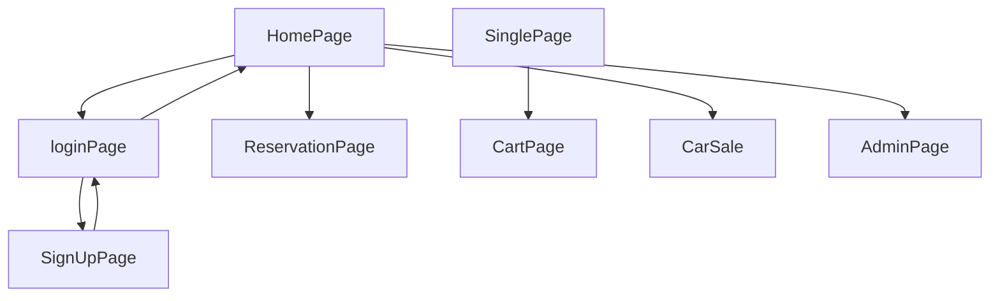

💻Clone Project - ✨AVIS-Clone✨   

---

Avis is India's leading mobility Company with services ranging from chauffeur drive and self-drive car rentals, car-pooling, operating lease and fleet management and has been present in the country for over 20 years. Our fleet consists of more than 5000 premium cars across a network of 50 rental stations in 19 cities in the country.This is a collaborative Project from Masai School in the Construct Week With the 5 team members within 5 Days.
---

✨Collaboraters Names Are:-

Shikha Gupta- Team Lead👩‍🎓   

Himanshu Sharma

Mandar Deshmukh

R Giri Reddy

Kallol Sarkar

 

💻Unique Project Name & logo :- CRUISE RENTALS🚗

---
 💫Tech-Stack->
For Frontend : HTML5, CSS3, Javascript, ES6, ReactJS Redux.

For Backend : NodeJS , ExpressJS , MongoDB 

For database: Json Server (cyclic).

For Styling :-  Chakra UI (UI Styling Library)

For live Project : - Netlify

---
## Features ✨
---
 | Serial No            | Feature                                                              |
| ----------------- | ------------------------------------------------------------------ |
| 1 | User signup and Login |
| 2 | Products Page with Filter and Sort Functionalities |
| 3 | Dynamic add to cart and SinglePage feature |
| 4 | Dynamic cart page using userId |
| 5 | Admin Login & Page |
| 6 | Dummy payment using UPI-Paytm |
| 7 | Homepage & Reservation Page |
| 8 | location Page & Map Display|

---
---
# Package.json(Backend ):-
| ----------------------------------------------------------------------------------- |
{
  "name": "backend",
  "version": "1.0.0",
  "description": "",
  "main": "index.js",
  "scripts": {
    "test": "echo \"Error: no test specified\" && exit 1",
    "server":"nodemon index.js"
  },
  "keywords": [],
  "author": "",
  "license": "ISC",
  "dependencies": {
    "bcrypt": "^5.1.0",
    "cors": "^2.8.5",
    "dotenv": "^16.0.3",
    "express": "^4.18.2",
    "jsonwebtoken": "^9.0.0",
    "mongoose": "^6.9.2",
    "nodemon": "^2.0.20"
  }
}
| ----------------------------------------------------------------------------------- |

## Flow

---
## Screenshots 📷
---

# HomePage

# Signup | Login

# Products | SinglePage

#  Payment 

# Admin 

---
# Admin Dashboard

---
⭐Deployed cyclic Link:-https://lime-silly-goshawk.cyclic

⭐Deployed  Link:-

----
<h1 align="center">✨Thank You✨</h1>
