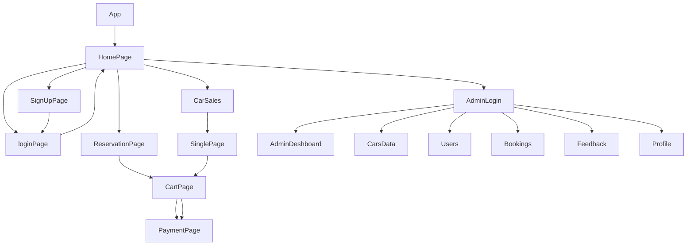

> 💻 CLONE PROJECT NAME⭐  --> ✨AVIS RENTALS💫
 

  

---

  

> Avis is India's leading mobility Company with services ranging from chauffeur drive and self-drive car rentals, car-Sales, operating lease and fleet management and has been present in the country for over 20 years.This was a collaborative Project which is made by 5 team members within 5 Days.
---

## 🔗 Collaborators Profile Links✨

| Collaborators | Github                                                                                                                                   | Linkedin                                                                                                                                                            | Portfolio                                                                                                                                    |
| ------------- | ---------------------------------------------------------------------------------------------------------------------------------------- | ------------------------------------------------------------------------------------------------------------------------------------------------------------------- | -------------------------------------------------------------------------------------------------------------------------------------------- |
| Shikha Gupta  (Team Lead)| |  | | 
| Mandar Deshmukh (Member 1) |  |  |  |
| R Giri Reddy (Member 2) |  | |  |
| Kallol Sarkar (Member 3)|  | |  |
| Himanshu Sharma (Member 4)|  | |  |

 

💻Unique Project Name & logo :- CRUISE RENTALS🚗

  

---
## 💫Tech-Stack->

- #### For Frontend :-
   - `HTML5`
  - `CSS3`
  - `JavaScript `
   - `Redux`
  - `ReactJS`
  - `Typescript `
   - `ES6 `

- #### For Backend :-
    - `NodeJS`
     - `ExpressJS`
    - `MongoDB `

- #### For deploy database :- 
      -`cyclic `

- #### For Styling :-  
   - `Chakra UI `
   - `BootStrap `

- #### For live Project : -
   - `Vercel`

---
## Features ✨:-
---
 | Serial No            | Feature                                                              |
| ----------------- | ------------------------------------------------------------------ |
| 1 | User signup and Login |
| 2 | Products Page with Filter and Sort Functionalities |
| 3 | Dynamic add to cart and SinglePage feature |
| 4 | Dynamic cart page using userId |
| 5 | Admin Login & Page |
| 6 | Dummy payment using UPI-Paytm |
| 7 | Homepage & Reservation Page |
| 8 | location Page & Map Display|

---
# Package.json(Dependency)✨:-

 | Serial No            | Backend                      |  Frontend      |
| ----------------- | -------------------|------------------------ |
| 1 | bcrypt |   Chakra-ui , BootStrap|
| 2 | mongoose |  React Router dom |
| 3 | cors |    redux ,react-icons |
| 4 | dotenv |  react redux ,axios |
| 5 | express | typescript |
| 6 | jsonwebtoken | redux thunk |

---

## Flow

---
## Screenshots 📷
---

# HomePage

# Signup | Login

# ReservationPage

# Products | SinglePage

#  Payment 

# Admin & AdminDeshboard

---

<h1 align="center">✨Thank You✨</h1>
