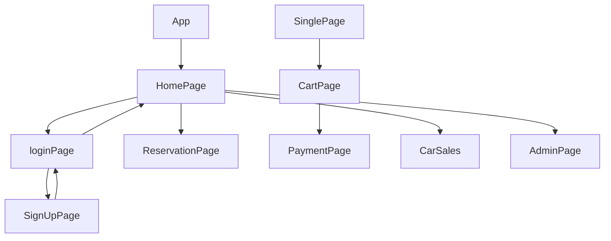

# 💻Clone Project - ⭐AVIS CLONE⭐  
      

---

Avis is India's leading mobility Company with services ranging from chauffeur drive and self-drive car rentals, car-pooling, operating lease and fleet management and has been present in the country for over 20 years. Our fleet consists of more than 5000 premium cars across a network of 50 rental stations in 19 cities in the country.This is a collaborative Project from Masai School in the Construct Week With the 5 team members within 5 Days.
---

## 🔗 Collaborators Profile Links✨

| Collaborators | Github                                                                                                                                   | Linkedin                                                                                                                                                            | Portfolio                                                                                                                                    |
| ------------- | ---------------------------------------------------------------------------------------------------------------------------------------- | ------------------------------------------------------------------------------------------------------------------------------------------------------------------- | -------------------------------------------------------------------------------------------------------------------------------------------- |
| Shikha Gupta |  |  |  |
| Mandar Deshmukh |  |  |  |
| R Giri Reddy |  | |  |
| Kallol Sarkar|  | |  |
| Himanshu Sharma|  | |  |

 

💻Unique Project Name & logo :- CRUISE RENTALS🚗

---
 💫Tech-Stack->
For Frontend : HTML5, CSS3, Javascript, ES6, ReactJS Redux.

For Backend : NodeJS , ExpressJS , MongoDB 

For database: Json Server (cyclic).

For Styling :-  Chakra UI (UI Styling Library)

For live Project : - Netlify

---
## Features ✨:-
---
 | Serial No            | Feature                                                              |
| ----------------- | ------------------------------------------------------------------ |
| 1 | User signup and Login |
| 2 | Products Page with Filter and Sort Functionalities |
| 3 | Dynamic add to cart and SinglePage feature |
| 4 | Dynamic cart page using userId |
| 5 | Admin Login & Page |
| 6 | Dummy payment using UPI-Paytm |
| 7 | Homepage & Reservation Page |
| 8 | location Page & Map Display|

---
---
# Package.json(Dependency)✨:-

 | Serial No            | Backend                      |  Frontend      |
| ----------------- | -------------------|------------------------ |
| 1 | bcrypt |   Chakra-uI    |
| 2 | mongoose |  React Router dom |
| 3 | cors |    redux |
| 4 | dotenv |  react redux |
| 5 | express |  date picker |
| 6 | jsonwebtoken | redux thunk |

---

## Flow

---
## Screenshots 📷
---

# HomePage

# Signup | Login

# Products | SinglePage

#  Payment 

# Admin 

---
# Admin Dashboard

---

----
<h1 align="center">✨Thank You✨</h1>
